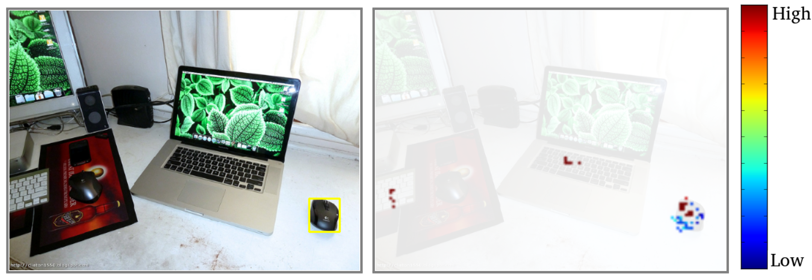

# HoughNet: Integrating near and long-range evidence for bottom-up object detection [ECCV-2020]

One-stage, anchor-free, voting-based, bottom-up object detector

> [**HoughNet: Integrating near and long-range evidence for bottom-up object detection**](http://arxiv.org/abs/1904.07850),            
> Nermin Samet, Samet Hicsonmez, Emre Akbas,        
> *arXiv technical report ([arXiv 1904.07850](http://arxiv.org/abs/1904.07850))*         

## Abstract
This paper presents HoughNet, a one-stage, anchor-free, voting-based,
bottom-up object detection method. Inspired by the Generalized Hough Transform,
HoughNet determines the presence of an object at a certain location by the sum of the
votes cast on that location. Votes are collected from both near and long-distance locations
based on a log-polar vote field. Thanks to this voting mechanism, HoughNet is able to integrate both near and long-range,
class-conditional evidence for visual recognition, thereby generalizing and enhancing current object detection methodology, which typically relies on only local evidence. On the COCO dataset, HoughNet achieves 46.4 AP (and 65.1 AP50), performing on par with the state-of-the-art in bottom-up object detection and outperforming most  major one-stage and two-stage methods. We further validate the effectiveness of our proposal in another task, namely, "labels to photo" image generation by integrating the voting module of HoughNet to two different GAN models and showing that the accuracy is significantly improved in both cases. 

## Features
- Hough voting idea is applied through a log-polar vote field to utilize short and long-range evidence in a deep
learning model for generic object detection.
- Our best single model achieves *46.4* AP on COCO test-dev.
- HoughNet is especially effective for small objects.
- We provide step-by-step animation of the voting process ([slides](https://docs.google.com/presentation/d/1TI9gL3RC7URcNI7C72xxBiozbd2aNnYGTPAzU-BNbbo/edit?usp=sharing))
- We provide Hough voting as a [module](src/lib/models/networks/hough_module.py) to be used in another works.
- We provide COCO `minitrain` as a mini training set. It is useful for hyperparameter tuning and reducing the cost of ablation experiments. `minitrain` is strongly  positively correlated with the performance of the same model trained on `train2017`. For experiments, object instance statistics and download please refer to [COCO minitrain](https://github.com/giddyyupp/coco-minitrain)

## Results on COCO val2017

| Backbone        | AP / AP50 | Multi-scale AP / AP50 |
|:---------------:|:----------:|:----------------------:|
|Hourglass-104    | 43.0 / 62.2 |  46.1 / 64.6         |
|ResNet-101 w DCN | 37.2 / 56.5 |  41.5 / 61.5         |
|ResNet-101       | 36.0 / 55.2 |  40.7 / 60.6         |

All models could be found in [Model zoo](readme/MODEL_ZOO.md).

## Installation

Please refer to [INSTALL.md](readme/INSTALL.md) for installation instructions.

## Evaluation and Training

For evaluation and training details please refer to [GETTING_STARTED.md](readme/GETTING_STARTED.md).

## Acknowledgement

This work was supported by the AWS Cloud Credits for Research program and by the Scientific and Technological Research Council of Turkey (TUBITAK) through the project titled "Object Detection in Videos with Deep Neural Networks" (grant number 117E054). The numerical calculations reported in this paper were partially performed at TUBITAK ULAKBIM,  High Performance and Grid Computing Center (TRUBA resources). We also thank the authors of [CenterNet](https://github.com/xingyizhou/CenterNet) for their clean code and inspiring work.

## License

HoughNet is released under the MIT License (refer to the [LICENSE](readme/LICENSE) file for details). We developed HoughNet on top of [CenterNet](https://github.com/xingyizhou/CenterNet). Please refer to the License of CenterNet for more detail.

## Citation

If you find this project useful for your research, please use the following BibTeX entry.

    @inproceedings{houghnet,
      title={HoughNet: Integrating near and long-range evidence for bottom-up object detection},
      author={Samet, Nermin and Hicsonmez, Samet and Akbas, Emre},
      booktitle={arXiv preprint arXiv:1904.07850},
      year={2020}
    }
